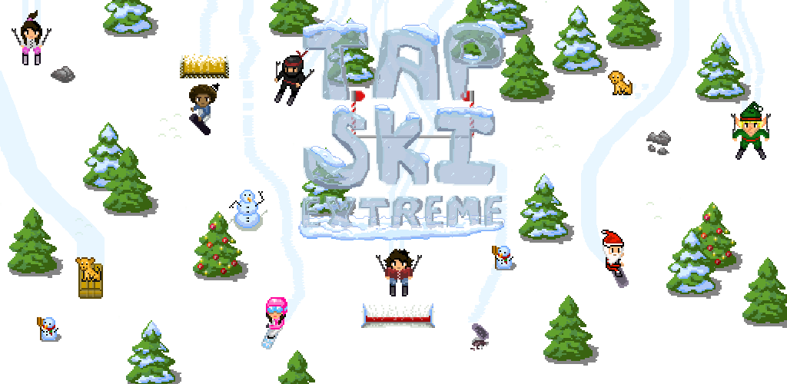

# tapski-unity

The source repository for the mobile game Tap Ski Extreme, available on [iOS](https://itunes.apple.com/us/app/todo), [Android](https://play.google.com/store/apps/details?id=todo), and as a direct download on our [releases page](https://tapski.com/releases).

## Releases

- [iOS](https://itunes.apple.com/us/app/todo)
- [Android](https://play.google.com/store/apps/details?id=todo)
- [Mac OS](https://tapski.com/releases)
- [Windows](https://tapski.com/releases)

## Contributing

Making a game is a lot of work, which means there are several ways in which you can participate in this project:

- Contribute directly to the codebase
- Submit bugs and feature requests
- Updating documentation

## Development

In order to work on this project you will need:

- [Unity3d](https://unity3d.com/get-unity/download)
- An IDE or text editor that can handle C#, such as [VS Code](https://code.visualstudio.com/), [Visual Studio](https://www.visualstudio.com/), or [Sublime Text](https://www.sublimetext.com/)

## License

The contents of this repository are released under two licenses:

- All source code has been made open-source via the AGPL license as detailed in [LICENSE.agpl-3.0](./LICENSE.agpl-3.0.md).
- All game assets, artwork, sound effects, and music are subject to the [Creative Commons SA 4.0](https://creativecommons.org/licenses/by-sa/4.0/) license as described in [LICENSE.by-nc-sa](./LICENSE.by-nc-sa.md). Practically speaking, this means that commercial use of these assets is not allowed without permission of the original authors.
